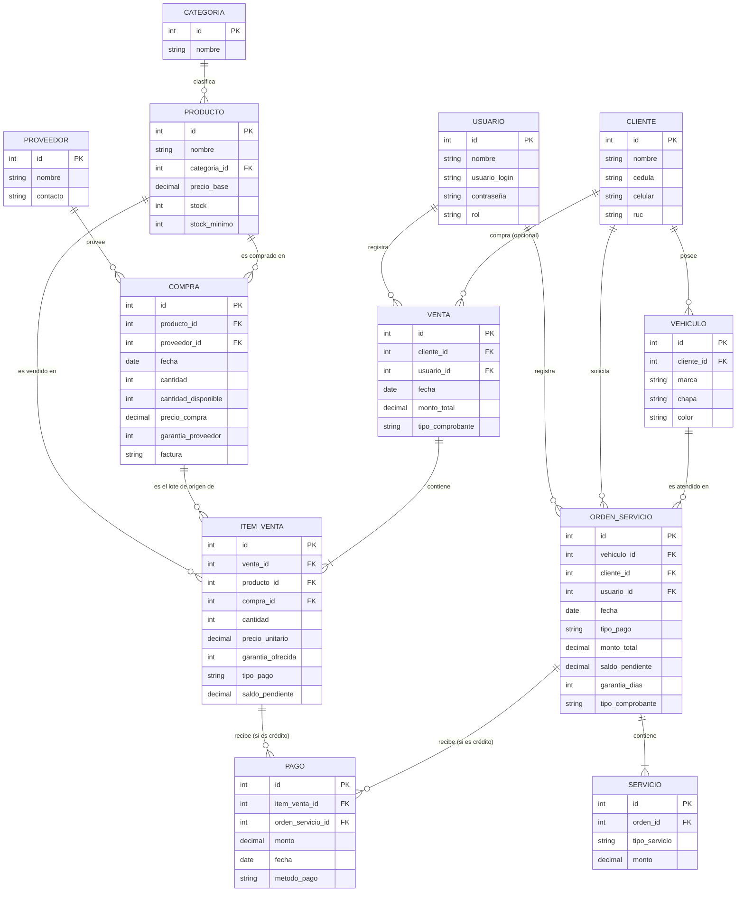

# Diagrama Entidad-Relación (DER)

*Basado en `entidades-dominio.md`. Representa el modelo de datos completo del sistema, incluyendo las correcciones acordadas en las revisiones posteriores (normalización de Orden de Servicio, garantía a nivel de visita, Categoría como entidad propia, etc.).*

## Notas sobre cardinalidades

- **CLIENTE–VENTA** es opcional del lado de Cliente (`o{`), ya que una Venta puede ser a un cliente "casual" no registrado, salvo cuando es a crédito (ver HU-10, donde el registro pasa a ser obligatorio a nivel de regla de negocio, no de modelo de datos).
- **VENTA–ITEM_VENTA** y **ORDEN_SERVICIO–SERVICIO** usan `|{` (uno o muchos) del lado del detalle, porque no tiene sentido una Venta sin productos ni una Orden de Servicio sin al menos un Servicio.
- **PRODUCTO–COMPRA** y **PRODUCTO–PROVEEDOR**: la relación muchos-a-muchos entre Producto y Proveedor no aparece como línea directa en el diagrama, porque queda resuelta a través de la entidad intermedia Compra (Proveedor → Compra → Producto).
- **ORDEN_SERVICIO.garantia_dias** es nullable/opcional, reflejando que el dueño no siempre la ofrece.
- **ITEM_VENTA/ORDEN_SERVICIO–PAGO** son relaciones excluyentes: un Pago referencia a uno de los dos, nunca ambos. Esto permite manejar crédito por producto individual (no por venta completa) y por orden de servicio completa, con pagos parciales acumulables en el tiempo — ver el caso de validación en `entidades-dominio.md`, sección 12.
- **Diferencia clave:** en Venta, `tipo_pago` vive en `ITEM_VENTA` (crédito por producto). En Orden de Servicio, `tipo_pago` vive en `ORDEN_SERVICIO` (crédito por visita completa, no por Servicio individual), reflejando cómo el dueño maneja el crédito en la práctica — ver `entidades-dominio.md`, sección 13.
- **COMPRA–ITEM_VENTA** (`compra_id`, **obligatorio**) traza de qué lote de compra proviene cada unidad vendida. No es opcional: dado que `PRODUCTO.stock` se calcula como la suma de `COMPRA.cantidad_disponible`, toda venta debe descontar de algún lote puntual — ver el problema y la corrección detallados en `entidades-dominio.md`, sección 14. Si la cantidad vendida de un producto supera lo disponible en un solo lote, el sistema genera automáticamente varios Ítems de Venta (uno por lote consumido) dentro de la misma Venta.

## Pendiente de confirmar

Este DER da por definidos los puntos abiertos que quedaban en `entidades-dominio.md` (sección 10), salvo el de "Garantía como entidad propia", que se mantiene resuelto acá como campos embebidos por simplicidad del MVP. Si en el futuro la lógica de garantía se complica (estados, vencimientos automáticos, etc.), este diagrama debería revisarse para introducir una entidad `GARANTIA` separada.